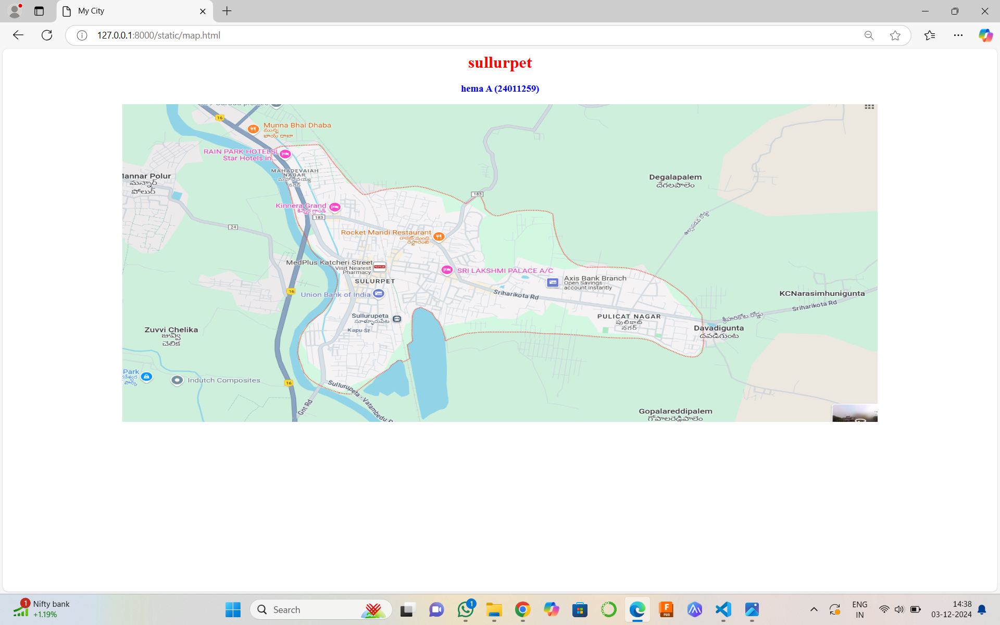
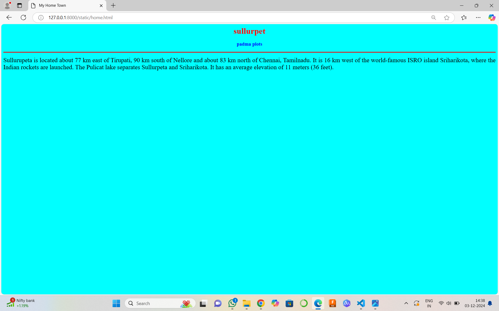
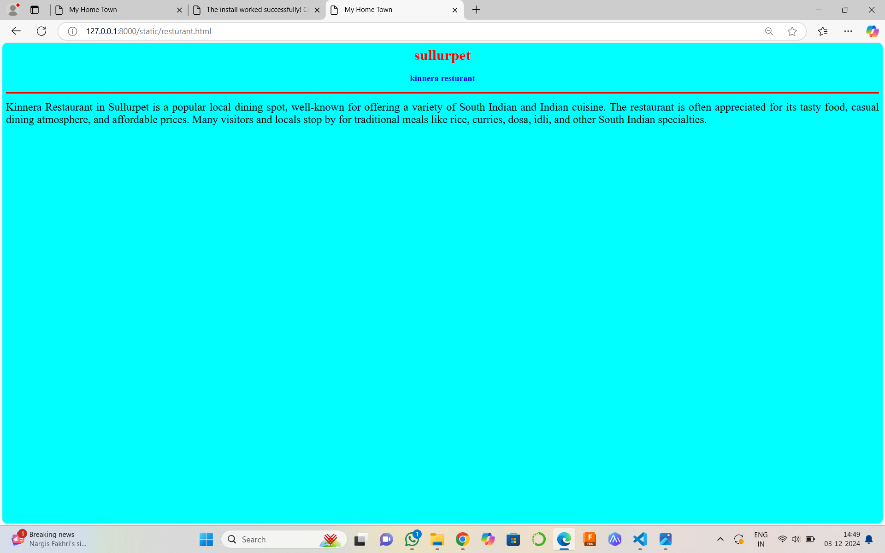
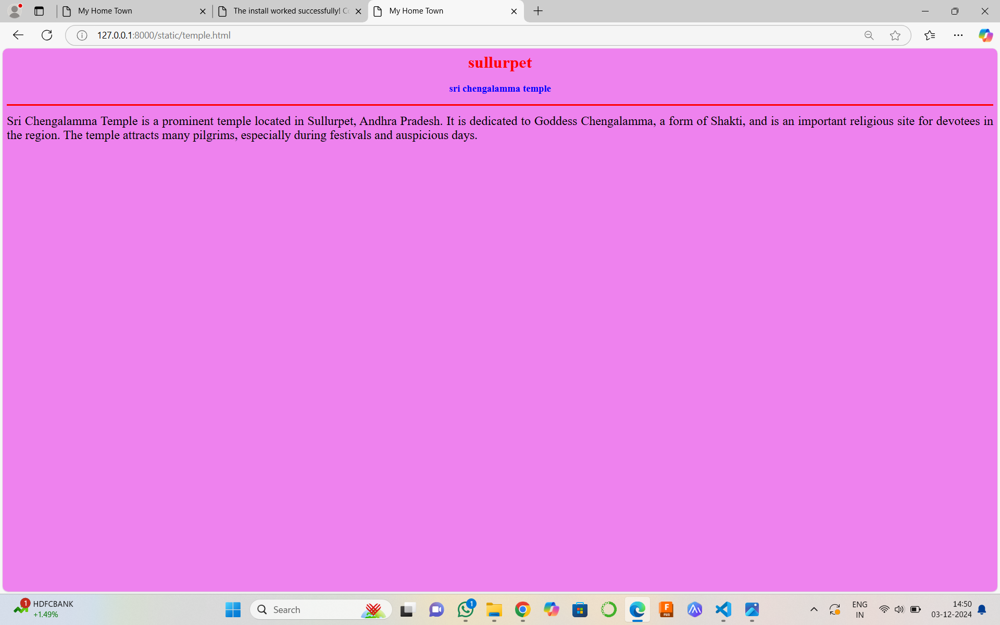
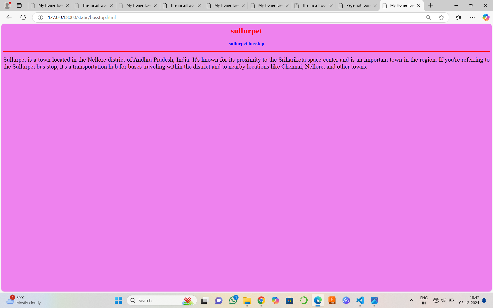
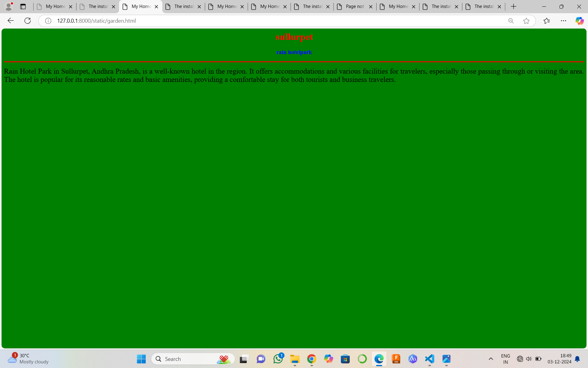

# Ex04 Places Around M
## Date: 2.12.2024

## AIM
To develop a website to display details about the places around my house.

## DESIGN STEPS

### STEP 1
Create a Django admin interface.

### STEP 2
Download your city map from Google.

### STEP 3
Using ```<map>``` tag name the map.

### STEP 4
Create clickable regions in the image using ```<area>``` tag.

### STEP 5
Write HTML programs for all the regions identified.

### STEP 6
Execute the programs and publish them.

## Code
'''
map.html U

<html>
    <head>
        <title>My City</title>
    </head>
    <body>
        <h1 align="center">
        <font color="red"><b>sullurpet</b></font>
        </h1>
        <h3 align="center">
            <font color="blue"><b>hema A (24011259)</b></font>
        </h3> 
        <center>
            
            <map name="MyCity">
            <area shape="rect" coords="700,300,900,900"href="home.html"title="My Home Town">
            <area shape="circle" coords="570,230,45"href="temple.html"title="sri chengalamma Temple">
            <area shape="circle" coords="700,200,40"href="garden.html"title="rain hotel park">
            <area shape="circle" coords="1120,360,25"href="busstop.html"title="sullurpet busstop">
            <area shape="rect" coords="700,300,900,900"href="resturant.html"title="kinnera resturant">
            </map>
        </center>

    </body>
</html>

resturant.html U

<html>
    <head>
        <title>My Home Town</title>
    </head>
    <body bgcolor="cyan">
    <h1 align="center">
        <font color="red"><b>sullurpet</b></font>
    </h1>
    <h3 align="center">
        <font color="blue"><b>kinnera resturant</b></font>
    </h3>
    <hr size="3" color="red">
    <p align="justify">
        <font face=""size="5">
            Kinnera Restaurant in Sullurpet is a popular local dining spot, well-known for offering a variety of South Indian and Indian cuisine. The restaurant is often appreciated for its tasty food, casual dining atmosphere, and affordable prices. Many visitors and locals stop by for traditional meals like rice, curries, dosa, idli, and other South Indian specialties.


        </font>
    </p>
</body>
</html>

garden.html U

<html>
    <head>
        <title>My Home Town</title>
    </head>
    <body bgcolor="green">
    <h1 align="center">
        <font color="red"><b>sullurpet</b></font>
    </h1>
    <h3 align="center">
        <font color="blue"><b>rain hotelpark</b></font>
    </h3>
    <hr size="3" color="red">
    <p align="justify">
        <font face=""size="5">
            Rain Hotel Park in Sullurpet, Andhra Pradesh, is a well-known hotel in the region. It offers accommodations and various facilities for travelers, especially those passing through or visiting the area. The hotel is popular for its reasonable rates and basic amenities, providing a comfortable stay for both tourists and business travelers.
        </font>
    </p>
</body>
</html>

temple.html U

<html>
    <head>
        <title>My Home Town</title>
    </head>
    <body bgcolor="violet">
    <h1 align="center">
        <font color="red"><b>sullurpet</b></font>
    </h1>
    <h3 align="center">
        <font color="blue"><b>sri chengalamma temple</b></font>
    </h3>
    <hr size="3" color="red">
    <p align="justify">
        <font face=""size="5">
            Sri Chengalamma Temple is a prominent temple located in Sullurpet, Andhra Pradesh. It is dedicated to Goddess Chengalamma, a form of Shakti, and is an important religious site for devotees in the region. The temple attracts many pilgrims, especially during festivals and auspicious days.
        </font>
    </p>
</body>
</html>


busstop.html U

<html>
    <head>
        <title>My Home Town</title>
    </head>
    <body bgcolor="violet">
    <h1 align="center">
        <font color="red"><b>sullurpet</b></font>
    </h1>
    <h3 align="center">
        <font color="blue"><b>sullurpet busstop</b></font>
    </h3>
    <hr size="3" color="red">
    <p align="justify">
        <font face=""size="5">
            Sullurpet is a town located in the Nellore district of Andhra Pradesh, India. It's known for its proximity to the Sriharikota space center and is an important town in the region. If you're referring to the Sullurpet bus stop, it's a transportation hub for buses traveling within the district and to nearby locations like Chennai, Nellore, and other towns.
        </font>
    </p>
</body>
</html>


home.html U

<html>
    <head>
        <title>My Home Town</title>
    </head>
    <body bgcolor="cyan">
    <h1 align="center">
        <font color="red"><b>sullurpet</b></font>
    </h1>
    <h3 align="center">
        <font color="blue"><b>padma plots</b></font>
    </h3>
    <hr size="3" color="red">
    <p align="justify">
        <font face=""size="5">
            Sullurupeta is located about 77 km east of Tirupati, 90 km south of Nellore and about 83 km north of Chennai, Tamilnadu. 
            It is 16 km west of the world-famous ISRO island Sriharikota, where the Indian rockets are launched. 
            The Pulicat lake separates Sullurpeta and Sriharikota. 
            It has an average elevation of 11 meters (36 feet).


        </font>
    </p>
</body>
</html>
'''


## OUTPUT







## RESULT
The program for implementing image maps using HTML is executed successfully.
